<!--
  Profile README — "Oxide 1-6 // Surveillance Console"
  Panels are self-contained animated SVGs generated by assets/build.py
  (Departure Mono font + dithered headshot embedded; CSS animations run
  inside GitHub's  rendering). Regenerate with:  python assets/build.py
  The telemetry card (github-metrics.svg) is rendered by .github/workflows/metrics.yml.
-->

<!-- ================= TELEMETRY (rendered daily by GitHub Actions) ================= -->

<!-- ================= ESTABLISH UPLINK (clickable social feeds) ================= -->

<table align="center" border="0" cellpadding="4" cellspacing="0">
  <tr>
    <td></td>
    <td></td>
    <td></td>
  </tr>
  <tr>
    <td></td>
    <td></td>
    <td></td>
  </tr>
</table>

<!-- ================= FIELD RECORDING (real ricing footage) ================= -->

https://github.com/user-attachments/assets/83d512dd-0014-42d0-9bfd-7520563b77e0

