<!--
  Profile README — "Oxide 1-6 // Surveillance Console"
  Every panel is a self-contained animated SVG generated by assets/build.py,
  which drives the modular generator in assets/builder/ (Departure Mono font +
  dithered headshot embedded; CSS animations run inside GitHub's 
  rendering). Live stats, languages, the contribution calendar, and the
  rotating quote are fetched at build time.
  Regenerate with:  python assets/build.py
  .github/workflows/refresh-profile.yml re-runs it every 3 hours.
  All panels use width="100%" so every section lines up with the video.
-->



<!-- ================= TELEMETRY (self-hosted; regenerate with assets/build.py) ================= -->


<!-- ================= ESTABLISH UPLINK (clickable social feeds) ================= -->

<table width="100%" border="0" cellpadding="3" cellspacing="0">
  <tr>
    <td width="33.33%"><a href="https://linkedin.com/in/partha-gogoi-736241308"></a></td>
    <td width="33.33%"><a href="mailto:yes.par781@gmail.com?subject=GitHub%20Contact&body=Hi%20Partha%2C%0A%0AI%20found%20you%20via%20GitHub.%0A"></a></td>
    <td width="33.33%"><a href="https://discord.com/users/848834469033017374"></a></td>
  </tr>
</table>

<!-- ================= FIELD RECORDING (VHS still links out; no native player chrome) ================= -->

<a href="https://github.com/user-attachments/assets/83d512dd-0014-42d0-9bfd-7520563b77e0"></a>

